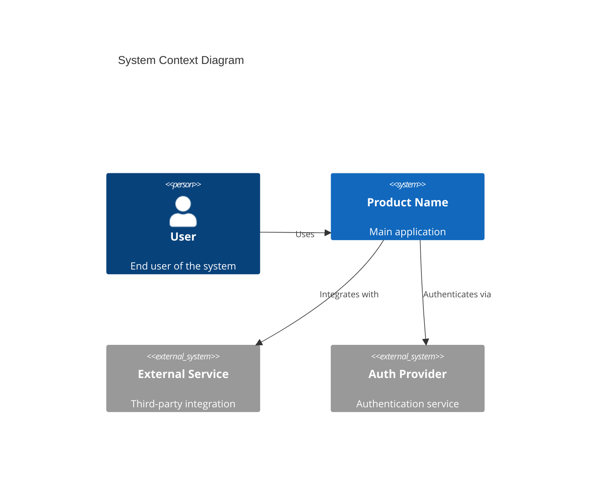
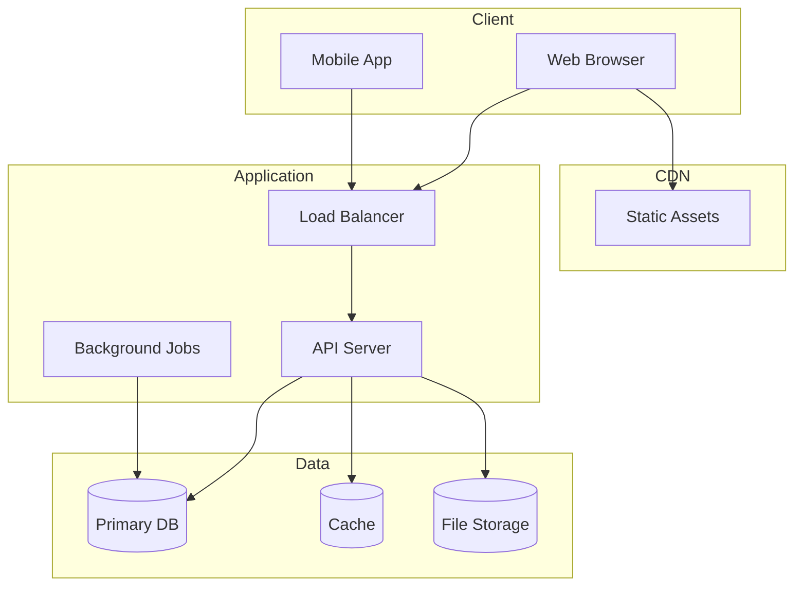
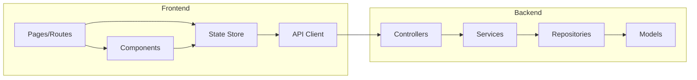
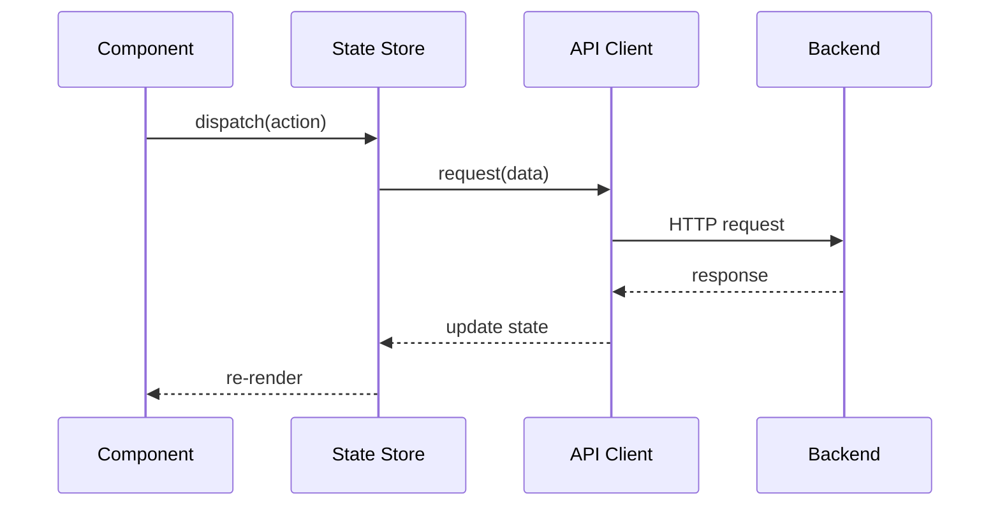
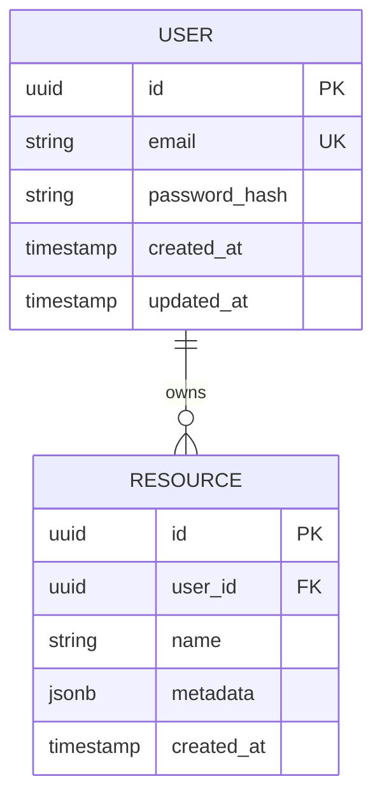
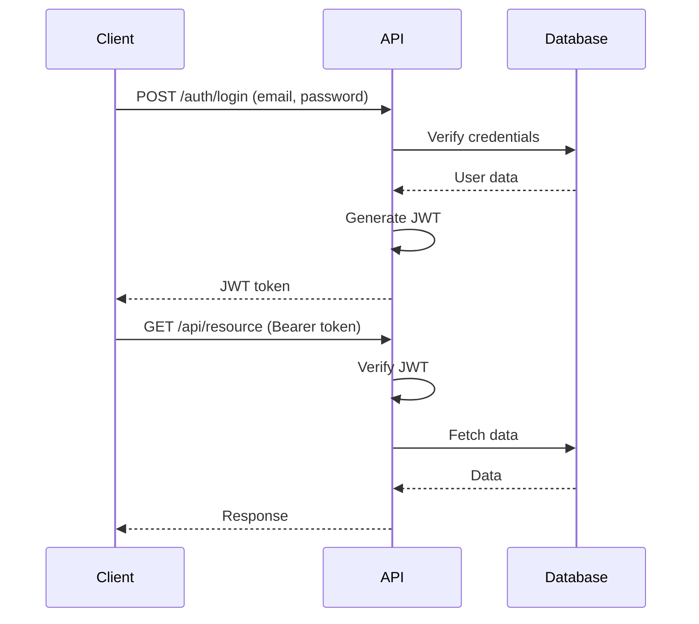
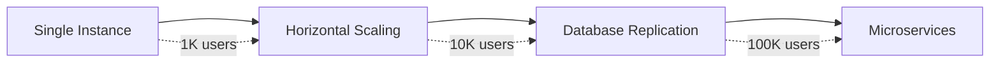
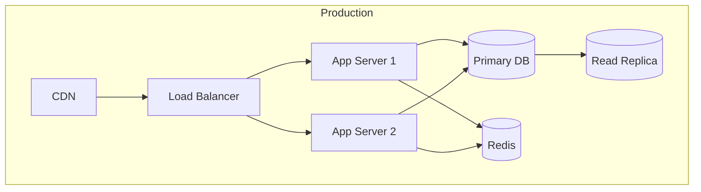
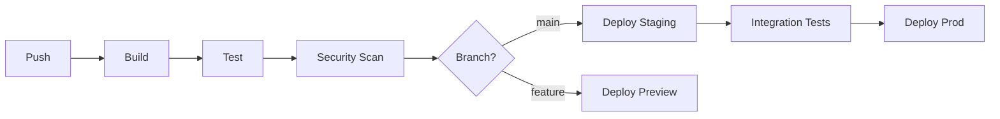

# Technical Architecture: {Product Name}

## 1. Architecture Overview

### 1.1 System Context



### 1.2 Key Architecture Decisions

| Decision | Choice | Rationale | Alternatives Considered |
|----------|--------|-----------|------------------------|
| AD-001: Frontend Framework | | | |
| AD-002: Backend Framework | | | |
| AD-003: Database | | | |
| AD-004: Hosting | | | |

### 1.3 Architecture Principles

| Principle | Description | Application |
|-----------|-------------|-------------|
| Separation of Concerns | | |
| Single Responsibility | | |
| DRY | | |
| KISS | | |

---

## 2. Technology Stack

### 2.1 Stack Overview

| Layer | Technology | Version | Rationale |
|-------|------------|---------|-----------|
| **Frontend** | | | |
| Framework | | | |
| State Management | | | |
| Styling | | | |
| Build Tool | | | |
| **Backend** | | | |
| Runtime | | | |
| Framework | | | |
| ORM/Database Client | | | |
| **Database** | | | |
| Primary DB | | | |
| Cache | | | |
| **Infrastructure** | | | |
| Hosting | | | |
| CDN | | | |
| CI/CD | | | |

### 2.2 Package Dependencies

#### Frontend Dependencies
```json
{
  "dependencies": {
    "framework": "^x.x.x"
  },
  "devDependencies": {
    "build-tool": "^x.x.x"
  }
}
```

#### Backend Dependencies
```json
{
  "dependencies": {
    "framework": "^x.x.x"
  }
}
```

### 2.3 Development Tools

| Tool | Purpose | Version |
|------|---------|---------|
| | Linting | |
| | Formatting | |
| | Testing | |
| | Type Checking | |

---

## 3. System Architecture

### 3.1 High-Level Architecture



### 3.2 Component Architecture



### 3.3 Directory Structure

```
project/
├── frontend/
│   ├── src/
│   │   ├── components/      # Reusable UI components
│   │   ├── pages/           # Route pages
│   │   ├── hooks/           # Custom hooks
│   │   ├── store/           # State management
│   │   ├── services/        # API clients
│   │   ├── utils/           # Utilities
│   │   └── types/           # TypeScript types
│   ├── public/              # Static assets
│   └── tests/               # Frontend tests
│
├── backend/
│   ├── src/
│   │   ├── controllers/     # Request handlers
│   │   ├── services/        # Business logic
│   │   ├── repositories/    # Data access
│   │   ├── models/          # Data models
│   │   ├── middleware/      # Express middleware
│   │   ├── routes/          # Route definitions
│   │   ├── utils/           # Utilities
│   │   └── types/           # TypeScript types
│   ├── migrations/          # Database migrations
│   └── tests/               # Backend tests
│
├── shared/                  # Shared types/utilities
├── docs/                    # Documentation
└── infrastructure/          # IaC configurations
```

---

## 4. Component Design

### 4.1 Frontend Components

#### Component: {Component Name}

**Responsibility:**
<!-- What this component does -->

**Interface:**
```typescript
interface ComponentProps {
  // Props definition
}

interface ComponentState {
  // State definition
}
```

**Dependencies:**
- Component A
- Service B

**Data Flow:**


### 4.2 Backend Services

#### Service: {Service Name}

**Responsibility:**
<!-- What this service does -->

**Interface:**
```typescript
interface ServiceInterface {
  method(params: Params): Promise<Result>;
}
```

**Dependencies:**
- Repository A
- External Service B

**Error Handling:**
| Error | Code | Response |
|-------|------|----------|
| NotFound | 404 | Resource not found |
| Validation | 400 | Invalid input |
| Auth | 401 | Unauthorized |

---

## 5. Data Architecture

### 5.1 Data Models



### 5.2 Database Schema

#### Table: users
| Column | Type | Constraints | Description |
|--------|------|-------------|-------------|
| id | UUID | PK, DEFAULT uuid_generate_v4() | Primary key |
| email | VARCHAR(255) | UNIQUE, NOT NULL | User email |
| password_hash | VARCHAR(255) | NOT NULL | Hashed password |
| created_at | TIMESTAMP | DEFAULT NOW() | Creation time |
| updated_at | TIMESTAMP | DEFAULT NOW() | Last update |

#### Indexes
```sql
CREATE INDEX idx_users_email ON users(email);
CREATE INDEX idx_resources_user_id ON resources(user_id);
```

### 5.3 Caching Strategy

| Data | Cache Location | TTL | Invalidation |
|------|----------------|-----|--------------|
| User session | Redis | 24h | On logout |
| Static data | CDN | 7d | Deploy |
| API responses | Memory | 5m | Time-based |

---

## 6. API Design

### 6.1 API Overview

| Method | Endpoint | Description | Auth |
|--------|----------|-------------|------|
| POST | /api/auth/login | User login | No |
| POST | /api/auth/register | User registration | No |
| GET | /api/users/me | Get current user | Yes |
| GET | /api/resources | List resources | Yes |
| POST | /api/resources | Create resource | Yes |
| GET | /api/resources/:id | Get resource | Yes |
| PUT | /api/resources/:id | Update resource | Yes |
| DELETE | /api/resources/:id | Delete resource | Yes |

### 6.2 API Contracts

#### POST /api/auth/login

**Request:**
```json
{
  "email": "string",
  "password": "string"
}
```

**Response (200):**
```json
{
  "token": "string",
  "user": {
    "id": "uuid",
    "email": "string"
  }
}
```

**Errors:**
| Code | Description |
|------|-------------|
| 400 | Invalid input |
| 401 | Invalid credentials |

### 6.3 Error Response Format

```json
{
  "error": {
    "code": "ERROR_CODE",
    "message": "Human readable message",
    "details": {}
  }
}
```

---

## 7. Security Architecture

### 7.1 Authentication



### 7.2 Authorization

| Role | Permissions |
|------|-------------|
| Admin | Full access |
| User | Own resources |
| Guest | Read-only public |

### 7.3 Security Measures

| Measure | Implementation | Purpose |
|---------|----------------|---------|
| HTTPS | TLS 1.3 | Transport security |
| Password Hashing | bcrypt (cost 12) | Credential protection |
| Rate Limiting | 100 req/min | DoS protection |
| CORS | Whitelist origins | Cross-origin protection |
| SQL Injection | Parameterized queries | Data protection |
| XSS | Content-Security-Policy | Script injection |
| CSRF | Token validation | Request forgery |

---

## 8. Performance Architecture

### 8.1 Performance Targets

| Metric | Target | Measurement |
|--------|--------|-------------|
| Page Load (LCP) | < 2.5s | Lighthouse |
| API Response (p95) | < 200ms | APM |
| Database Query (p95) | < 50ms | Query logs |
| Throughput | 1000 req/s | Load testing |

### 8.2 Optimization Strategies

| Area | Strategy | Expected Impact |
|------|----------|-----------------|
| Frontend | Code splitting | -40% initial bundle |
| Frontend | Image optimization | -60% image size |
| Backend | Connection pooling | +30% throughput |
| Backend | Query optimization | -50% query time |
| Caching | CDN static assets | -80% origin requests |
| Caching | API response cache | -60% DB load |

### 8.3 Scalability Plan



---

## 9. Infrastructure

### 9.1 Deployment Architecture



### 9.2 Environment Configuration

| Environment | Purpose | Config |
|-------------|---------|--------|
| Development | Local dev | Local DB, debug mode |
| Staging | Pre-prod testing | Prod-like, test data |
| Production | Live system | Full redundancy |

### 9.3 CI/CD Pipeline



---

## 10. Implementation Roadmap

### 10.1 Phase 1: Foundation (MVP)

| Task | Description | Dependencies |
|------|-------------|--------------|
| T-001 | Project setup | None |
| T-002 | Database schema | T-001 |
| T-003 | Authentication | T-002 |
| T-004 | Core API endpoints | T-003 |
| T-005 | Basic frontend | T-004 |

### 10.2 Phase 2: Core Features

| Task | Description | Dependencies |
|------|-------------|--------------|
| T-006 | Feature A implementation | T-005 |
| T-007 | Feature B implementation | T-005 |
| T-008 | Integration testing | T-006, T-007 |

### 10.3 Phase 3: Enhancement

| Task | Description | Dependencies |
|------|-------------|--------------|
| T-009 | Performance optimization | T-008 |
| T-010 | Monitoring setup | T-008 |
| T-011 | Documentation | T-008 |

---

## 11. Technical Risks

| Risk | Probability | Impact | Mitigation |
|------|-------------|--------|------------|
| Third-party API downtime | Medium | High | Circuit breaker, fallback |
| Database performance | Low | High | Indexing, read replicas |
| Security vulnerabilities | Medium | Critical | Security audits, updates |
| Scalability bottleneck | Low | Medium | Load testing, monitoring |

---

## 12. Monitoring & Observability

### 12.1 Logging Strategy

| Log Type | Level | Retention | Tool |
|----------|-------|-----------|------|
| Application | INFO | 30 days | |
| Error | ERROR | 90 days | |
| Access | INFO | 7 days | |
| Audit | ALL | 1 year | |

### 12.2 Metrics

| Metric | Type | Alert Threshold |
|--------|------|-----------------|
| Request latency | Histogram | p95 > 500ms |
| Error rate | Counter | > 1% |
| CPU usage | Gauge | > 80% |
| Memory usage | Gauge | > 85% |

### 12.3 Alerting

| Alert | Severity | Response |
|-------|----------|----------|
| High error rate | Critical | Immediate |
| High latency | Warning | 15 min |
| Disk space low | Warning | 1 hour |

---

## 13. Revision History

| Version | Date | Changes | PRD/UIUX Version |
|---------|------|---------|------------------|
| 1.0.0 | {DATE} | Initial architecture | 1.0.0 / 1.0.0 |

---

## Appendix

### A. Technology Evaluation Matrix

| Criteria | Option A | Option B | Option C |
|----------|----------|----------|----------|
| Performance | | | |
| Scalability | | | |
| Community | | | |
| Learning Curve | | | |
| Cost | | | |
| **Total** | | | |

### B. API Documentation
- OpenAPI/Swagger: [Link]

### C. Architecture Decision Records (ADR)
- ADR-001: [Link]
- ADR-002: [Link]
