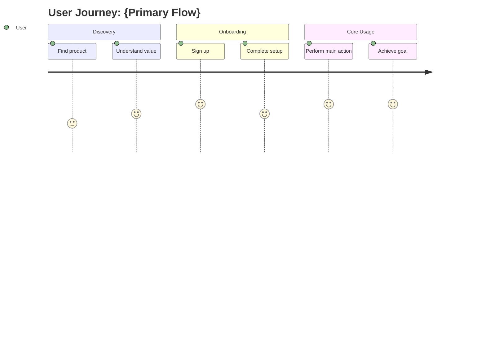
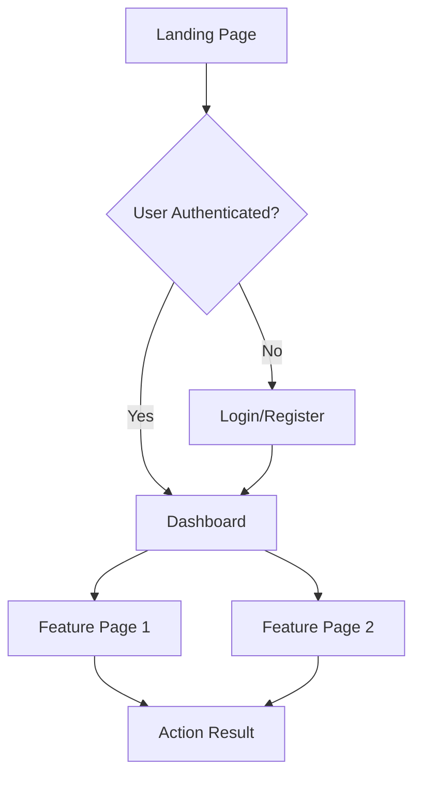
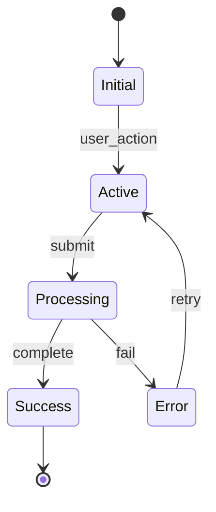

# Product Requirements Document: {Product Name}

## 1. Executive Summary

### 1.1 Product Vision
<!-- One paragraph describing the product's purpose and long-term vision -->

### 1.2 Key Value Proposition
<!-- What unique value does this product provide? -->

### 1.3 Target Market
<!-- Primary and secondary target audiences -->

| Segment | Description | Size Estimate |
|---------|-------------|---------------|
| Primary | | |
| Secondary | | |

---

## 2. Market Analysis

### 2.1 Competitive Landscape

| Competitor | Website | Strengths | Weaknesses | Our Differentiation |
|------------|---------|-----------|------------|---------------------|
| | | | | |
| | | | | |
| | | | | |

### 2.2 Market Opportunity
<!-- Market size, growth trends, and timing considerations -->

### 2.3 SWOT Analysis

| Strengths | Weaknesses |
|-----------|------------|
| | |

| Opportunities | Threats |
|---------------|---------|
| | |

---

## 3. User Personas

### 3.1 Primary Persona: {Persona Name}

| Attribute | Description |
|-----------|-------------|
| **Role** | |
| **Age Range** | |
| **Technical Level** | |
| **Goals** | |
| **Pain Points** | |
| **Behaviors** | |
| **Quote** | |

### 3.2 Secondary Persona: {Persona Name}

| Attribute | Description |
|-----------|-------------|
| **Role** | |
| **Goals** | |
| **Pain Points** | |

---

## 4. Product Features

### 4.1 Feature Matrix

| ID | Feature | Priority | User Story | Acceptance Criteria | Effort |
|----|---------|----------|------------|---------------------|--------|
| F-001 | | P0 | | | |
| F-002 | | P0 | | | |
| F-003 | | P1 | | | |
| F-004 | | P1 | | | |
| F-005 | | P2 | | | |

**Priority Legend:**
- **P0**: Must-have for MVP (launch blocker)
- **P1**: Should-have (high value, post-MVP)
- **P2**: Nice-to-have (future enhancement)
- **P3**: Wishlist (long-term backlog)

### 4.2 Feature Details

#### F-001: {Feature Name}

**User Story:**
> As a [user type], I want [action] so that [benefit].

**Acceptance Criteria:**
- [ ] Criterion 1
- [ ] Criterion 2
- [ ] Criterion 3

**Dependencies:**
- None / [Feature IDs]

**Technical Notes:**
<!-- Any technical considerations -->

---

## 5. User Flows & Interaction Logic

### 5.1 Core User Journey

### 5.2 Page Flow Diagram

### 5.3 State Transitions

---

## 6. Functional Requirements

### 6.1 User Authentication
| Requirement | Description | Priority |
|-------------|-------------|----------|
| AUTH-001 | | P0 |
| AUTH-002 | | P0 |

### 6.2 Core Functionality
| Requirement | Description | Priority |
|-------------|-------------|----------|
| CORE-001 | | P0 |
| CORE-002 | | P0 |

### 6.3 Data Management
| Requirement | Description | Priority |
|-------------|-------------|----------|
| DATA-001 | | P1 |
| DATA-002 | | P1 |

---

## 7. Non-Functional Requirements

### 7.1 Performance
- Page load time: < X seconds
- API response time: < X ms
- Concurrent users: X

### 7.2 Security
- Authentication method:
- Data encryption:
- Compliance requirements:

### 7.3 Scalability
- Expected growth:
- Scaling strategy:

### 7.4 Accessibility
- WCAG compliance level:
- Screen reader support:

---

## 8. Success Metrics

### 8.1 Key Performance Indicators (KPIs)

| Metric | Target | Measurement Method |
|--------|--------|-------------------|
| User Acquisition | | |
| User Retention | | |
| Feature Adoption | | |
| User Satisfaction | | |

### 8.2 Success Criteria for MVP
- [ ] Criterion 1
- [ ] Criterion 2
- [ ] Criterion 3

---

## 9. Constraints & Assumptions

### 9.1 Technical Constraints
- Platform limitations:
- Integration requirements:
- Technology mandates:

### 9.2 Business Constraints
- Budget:
- Timeline:
- Resources:

### 9.3 Assumptions
- [ ] Assumption 1
- [ ] Assumption 2
- [ ] Assumption 3

---

## 10. Out of Scope

| Item | Reason | Future Consideration |
|------|--------|---------------------|
| | | |
| | | |

---

## 11. Risks & Mitigations

| Risk | Probability | Impact | Mitigation Strategy |
|------|-------------|--------|---------------------|
| | High/Med/Low | High/Med/Low | |
| | | | |

---

## 12. Revision History

| Version | Date | Changes | Author |
|---------|------|---------|--------|
| 1.0.0 | {DATE} | Initial PRD | Product Manager Agent |

---

## Appendix

### A. Glossary
| Term | Definition |
|------|------------|
| | |

### B. References
- [Reference 1]()
- [Reference 2]()
