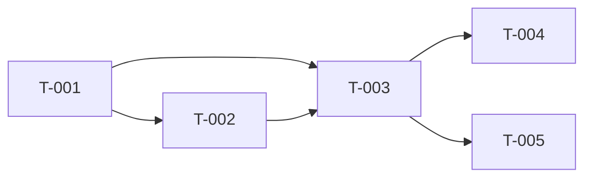

# Project TODO: {Product Name}

## Overview

| Metric | Count |
|--------|-------|
| Total Tasks | 0 |
| Completed | 0 |
| In Progress | 0 |
| Pending | 0 |
| Blocked | 0 |

**Progress:** ░░░░░░░░░░ 0%

---

## Milestones

### M1: {Milestone Name}
| Attribute | Value |
|-----------|-------|
| **Target Date** | YYYY-MM-DD |
| **Status** | Not Started / In Progress / Complete |
| **Tasks** | T-001, T-002, T-003 |
| **Progress** | 0/3 |

### M2: {Milestone Name}
| Attribute | Value |
|-----------|-------|
| **Target Date** | YYYY-MM-DD |
| **Status** | Not Started |
| **Tasks** | T-004, T-005 |
| **Progress** | 0/2 |

---

## Task List

### Phase 1: Foundation

#### T-001: {Task Name}

| Attribute | Value |
|-----------|-------|
| **Priority** | P0 |
| **Estimate** | X hours |
| **Dependencies** | None |
| **Milestone** | M1 |
| **Status** | ⬜ Pending |
| **Assignee** | - |

**Description:**
<!-- Detailed task description -->

**Acceptance Criteria:**
- [ ] Criterion 1
- [ ] Criterion 2
- [ ] Criterion 3

**PRD Reference:** F-001
**UIUX Reference:** Section 3.1
**Architecture Reference:** Section 4.1

**Technical Notes:**
<!-- Implementation hints -->

---

#### T-002: {Task Name}

| Attribute | Value |
|-----------|-------|
| **Priority** | P0 |
| **Estimate** | X hours |
| **Dependencies** | T-001 |
| **Milestone** | M1 |
| **Status** | ⬜ Pending |
| **Assignee** | - |

**Description:**
<!-- Detailed task description -->

**Acceptance Criteria:**
- [ ] Criterion 1
- [ ] Criterion 2

**PRD Reference:** F-002
**Technical Notes:**
<!-- Implementation hints -->

---

### Phase 2: Core Features

#### T-003: {Task Name}

| Attribute | Value |
|-----------|-------|
| **Priority** | P1 |
| **Estimate** | X hours |
| **Dependencies** | T-001, T-002 |
| **Milestone** | M1 |
| **Status** | ⬜ Pending |
| **Assignee** | - |

**Description:**
<!-- Detailed task description -->

**Acceptance Criteria:**
- [ ] Criterion 1
- [ ] Criterion 2

---

### Phase 3: Enhancement

#### T-004: {Task Name}

| Attribute | Value |
|-----------|-------|
| **Priority** | P2 |
| **Estimate** | X hours |
| **Dependencies** | T-003 |
| **Milestone** | M2 |
| **Status** | ⬜ Pending |
| **Assignee** | - |

---

## Dependency Graph



---

## Priority Matrix

### P0 - Critical (MVP Blockers)

| Task | Status | Estimate | Blockers |
|------|--------|----------|----------|
| T-001 | ⬜ Pending | Xh | - |
| T-002 | ⬜ Pending | Xh | T-001 |

### P1 - High (Should Have)

| Task | Status | Estimate | Blockers |
|------|--------|----------|----------|
| T-003 | ⬜ Pending | Xh | T-001, T-002 |

### P2 - Medium (Nice to Have)

| Task | Status | Estimate | Blockers |
|------|--------|----------|----------|
| T-004 | ⬜ Pending | Xh | T-003 |

### P3 - Low (Future)

| Task | Status | Estimate | Blockers |
|------|--------|----------|----------|
| - | - | - | - |

---

## Workload Summary

### By Phase

| Phase | Tasks | Total Hours | Status |
|-------|-------|-------------|--------|
| Foundation | 2 | Xh | Not Started |
| Core Features | 2 | Xh | Not Started |
| Enhancement | 1 | Xh | Not Started |

### By Priority

| Priority | Tasks | Total Hours |
|----------|-------|-------------|
| P0 | 2 | Xh |
| P1 | 2 | Xh |
| P2 | 1 | Xh |

---

## Risk Register

| Risk | Probability | Impact | Mitigation | Owner | Status |
|------|-------------|--------|------------|-------|--------|
| | High/Med/Low | High/Med/Low | | | Open |
| | | | | | |

---

## Blockers & Issues

### Active Blockers

| ID | Description | Affected Tasks | Resolution | Owner |
|----|-------------|----------------|------------|-------|
| B-001 | | T-XXX | | |

### Resolved Blockers

| ID | Description | Resolution Date | Resolution |
|----|-------------|-----------------|------------|
| - | - | - | - |

---

## Status Legend

| Symbol | Status | Description |
|--------|--------|-------------|
| ⬜ | Pending | Not started |
| 🔄 | In Progress | Currently working |
| ✅ | Complete | Done and verified |
| ❌ | Blocked | Cannot proceed |
| ⏸️ | On Hold | Paused |
| 🚫 | Cancelled | Will not be done |

---

## Task Completion Log

| Date | Task | Completed By | Notes |
|------|------|--------------|-------|
| | | | |

---

## Document Sync Status

| Document | Version | Synced | Last Check |
|----------|---------|--------|------------|
| PRD | 1.0.0 | ✅ | {DATE} |
| UIUX | 1.0.0 | ✅ | {DATE} |
| Architecture | 1.0.0 | ✅ | {DATE} |

**⚠️ Pending Updates:** None

---

## Revision History

| Version | Date | Changes | Source Versions |
|---------|------|---------|-----------------|
| 1.0.0 | {DATE} | Initial TODO | PRD 1.0.0, UIUX 1.0.0, ARCH 1.0.0 |

---

## Quick Actions

### Start Next Task
```bash
# Find next available P0 task without blockers
# Update status to 🔄 In Progress
```

### Mark Task Complete
```bash
# Update status to ✅ Complete
# Update Overview counts
# Log in Completion Log
# Check if milestone complete
```

### Add New Task
```bash
# Use template below
# Assign T-XXX ID
# Set dependencies
# Update Overview counts
```

### Task Template
```markdown
#### T-XXX: {Task Name}

| Attribute | Value |
|-----------|-------|
| **Priority** | PX |
| **Estimate** | X hours |
| **Dependencies** | T-XXX |
| **Milestone** | MX |
| **Status** | ⬜ Pending |
| **Assignee** | - |

**Description:**


**Acceptance Criteria:**
- [ ]

**PRD Reference:** F-XXX
```
