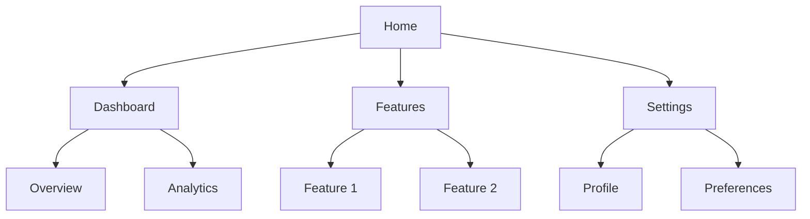
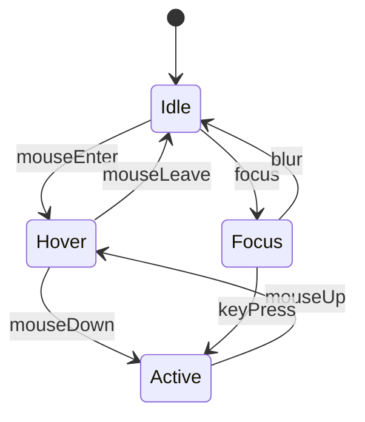
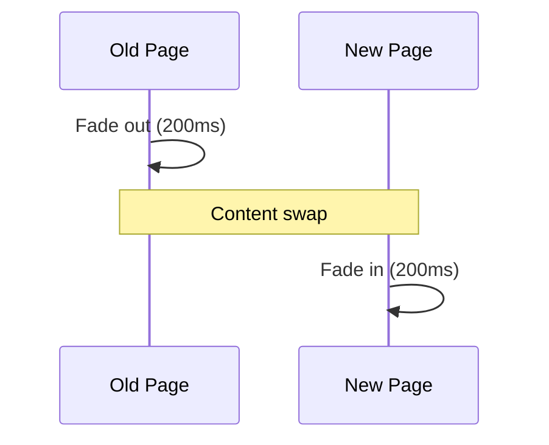

# UI/UX Specification: {Product Name}

## 1. Design Overview

### 1.1 Design Philosophy
<!-- Core design principles guiding all decisions -->

| Principle | Description | Application |
|-----------|-------------|-------------|
| Clarity | | |
| Efficiency | | |
| Consistency | | |
| Accessibility | | |

### 1.2 Design System Reference
<!-- Reference to existing design system or define custom -->

- **Primary Framework**:
- **Component Library**:
- **Icon Set**:
- **Typography**:

### 1.3 Brand Guidelines

| Element | Value | Usage |
|---------|-------|-------|
| Primary Color | `#` | Main actions, primary buttons |
| Secondary Color | `#` | Secondary elements |
| Accent Color | `#` | Highlights, notifications |
| Background | `#` | Page backgrounds |
| Text Primary | `#` | Main body text |
| Text Secondary | `#` | Muted text, placeholders |

---

## 2. Information Architecture

### 2.1 Site Map



### 2.2 Navigation Structure

| Level | Item | Path | Access |
|-------|------|------|--------|
| L1 | Home | / | Public |
| L1 | Dashboard | /dashboard | Auth |
| L2 | Overview | /dashboard/overview | Auth |
| L2 | Analytics | /dashboard/analytics | Auth |
| L1 | Settings | /settings | Auth |

### 2.3 User Flow Priority

| Flow | Priority | Entry Point | Goal |
|------|----------|-------------|------|
| Onboarding | P0 | Landing | Account setup |
| Core Action | P0 | Dashboard | Primary value |
| Settings | P1 | Header | Configuration |

---

## 3. Page Specifications

### 3.1 Page: {Page Name}

#### Layout Structure

```
┌─────────────────────────────────────────────────────────┐
│                      Header (64px)                       │
├─────────────────────────────────────────────────────────┤
│        │                                                 │
│  Side  │              Main Content Area                  │
│  Nav   │                 (flex-grow)                     │
│ (240px)│                                                 │
│        │                                                 │
├─────────────────────────────────────────────────────────┤
│                      Footer (48px)                       │
└─────────────────────────────────────────────────────────┘
```

#### Grid System
- **Columns**: 12
- **Gutter**: 24px
- **Margin**: 32px (desktop), 16px (mobile)
- **Max Width**: 1440px

#### Visual Hierarchy
1. Page Title (H1)
2. Section Headers (H2)
3. Card Headers (H3)
4. Body Content
5. Helper Text

#### Components Used

| Component | Variant | Props | Behavior |
|-----------|---------|-------|----------|
| Button | Primary | `size="lg"` | Submit action |
| Input | Text | `placeholder="..."` | User input |
| Card | Elevated | `shadow="md"` | Content container |

#### Responsive Breakpoints

| Breakpoint | Width | Layout Changes |
|------------|-------|----------------|
| Desktop | ≥1024px | Full sidebar, 3-column grid |
| Tablet | 768-1023px | Collapsed sidebar, 2-column |
| Mobile | <768px | Bottom nav, 1-column |

---

## 4. Component Library

### 4.1 Component: Button

**Variants:**
| Variant | Use Case | Example |
|---------|----------|---------|
| Primary | Main actions | Submit, Save |
| Secondary | Secondary actions | Cancel, Back |
| Tertiary | Subtle actions | Learn more |
| Destructive | Dangerous actions | Delete |

**States:**
```
┌─────────────────────────────────────────────────────┐
│  Default    Hover      Active     Disabled  Loading │
│  ┌─────┐   ┌─────┐    ┌─────┐    ┌─────┐   ┌─────┐ │
│  │     │   │░░░░░│    │▓▓▓▓▓│    │ /// │   │ ◐ │ │
│  └─────┘   └─────┘    └─────┘    └─────┘   └─────┘ │
└─────────────────────────────────────────────────────┘
```

**Props:**
| Prop | Type | Default | Description |
|------|------|---------|-------------|
| variant | string | "primary" | Button style |
| size | string | "md" | sm, md, lg |
| disabled | boolean | false | Disabled state |
| loading | boolean | false | Loading state |
| icon | ReactNode | null | Leading icon |

**Accessibility:**
- Focus ring: 2px offset
- Keyboard: Enter/Space activation
- ARIA: `role="button"`, `aria-disabled`

### 4.2 Component: Input

**Variants:**
| Variant | Use Case |
|---------|----------|
| Text | General text input |
| Password | Secure input |
| Search | Search functionality |
| Textarea | Multi-line input |

**States:**
- Default
- Focus
- Error
- Disabled
- Read-only

**Validation:**
| Validation | Message | Trigger |
|------------|---------|---------|
| Required | "This field is required" | onBlur |
| Email | "Enter a valid email" | onBlur |
| Min Length | "Minimum {n} characters" | onChange |

### 4.3 Component: Card

**Structure:**
```
┌────────────────────────────────────┐
│ Header (optional)          Actions │
├────────────────────────────────────┤
│                                    │
│            Content                 │
│                                    │
├────────────────────────────────────┤
│ Footer (optional)                  │
└────────────────────────────────────┘
```

**Variants:**
- Flat: No shadow, border only
- Elevated: Shadow depth
- Interactive: Hover effects, clickable

---

## 5. Interaction Patterns

### 5.1 State Transitions



### 5.2 Loading States

| State | Duration | Visual |
|-------|----------|--------|
| Initial Load | >300ms | Skeleton |
| Action Pending | Immediate | Button spinner |
| Data Refresh | >500ms | Overlay spinner |
| Background | Silent | Progress bar |

### 5.3 Error Handling

| Error Type | Display Method | Action |
|------------|----------------|--------|
| Field Validation | Inline message | Focus field |
| Form Submission | Toast notification | Retry button |
| Network Error | Full-page error | Retry/refresh |
| 404 | Custom page | Navigation |

### 5.4 Feedback Patterns

| Action | Feedback Type | Duration |
|--------|--------------|----------|
| Save | Toast success | 3s auto-dismiss |
| Delete | Confirmation modal | User action |
| Error | Toast error | Persistent |
| Progress | Progress bar | Until complete |

---

## 6. Animation Specifications

### 6.1 Timing Functions

| Name | Value | Use Case |
|------|-------|----------|
| ease-out | cubic-bezier(0, 0, 0.2, 1) | Enter animations |
| ease-in | cubic-bezier(0.4, 0, 1, 1) | Exit animations |
| ease-in-out | cubic-bezier(0.4, 0, 0.2, 1) | Movement |
| spring | cubic-bezier(0.175, 0.885, 0.32, 1.275) | Bouncy effects |

### 6.2 Duration Standards

| Type | Duration | Use Case |
|------|----------|----------|
| Instant | 0ms | State changes |
| Fast | 100ms | Hover, focus |
| Normal | 200ms | Transitions |
| Slow | 300ms | Page transitions |
| Complex | 500ms | Multi-step animations |

### 6.3 Micro-interactions

#### Button Press
```css
.button:active {
  transform: scale(0.98);
  transition: transform 100ms ease-out;
}
```

#### Card Hover
```css
.card:hover {
  transform: translateY(-2px);
  box-shadow: 0 4px 12px rgba(0,0,0,0.15);
  transition: all 200ms ease-out;
}
```

### 6.4 Page Transitions



---

## 7. Responsive Design

### 7.1 Breakpoint Behavior

| Component | Desktop (≥1024) | Tablet (768-1023) | Mobile (<768) |
|-----------|-----------------|-------------------|---------------|
| Navigation | Sidebar | Collapsed sidebar | Bottom nav |
| Grid | 3 columns | 2 columns | 1 column |
| Typography | Base | 0.95x scale | 0.9x scale |
| Spacing | Base | 0.875x | 0.75x |

### 7.2 Touch Targets

| Element | Minimum Size | Spacing |
|---------|--------------|---------|
| Button | 44x44px | 8px |
| Link | 44x44px tap area | 4px |
| Icon Button | 48x48px | 8px |

### 7.3 Mobile-Specific Patterns

- **Bottom Sheet**: For secondary actions
- **Pull to Refresh**: For data refresh
- **Swipe Actions**: For list items
- **Floating Action Button**: For primary action

---

## 8. Accessibility (A11y)

### 8.1 WCAG Compliance

| Criterion | Level | Status | Implementation |
|-----------|-------|--------|----------------|
| 1.1.1 Non-text Content | A | ✅ | Alt text for images |
| 1.4.3 Contrast | AA | ✅ | 4.5:1 ratio |
| 2.1.1 Keyboard | A | ✅ | Full keyboard nav |
| 2.4.7 Focus Visible | AA | ✅ | Focus indicators |

### 8.2 Screen Reader Support

| Element | ARIA | Announcement |
|---------|------|--------------|
| Button | `aria-label` | Action description |
| Modal | `aria-modal="true"` | Dialog context |
| Alert | `role="alert"` | Immediate announcement |
| Navigation | `role="navigation"` | Landmark |

### 8.3 Keyboard Navigation

| Key | Action |
|-----|--------|
| Tab | Move focus forward |
| Shift+Tab | Move focus backward |
| Enter/Space | Activate |
| Escape | Close/cancel |
| Arrow keys | Navigate within components |

---

## 9. Assets & Resources

### 9.1 SVG Icons

```svg
<!-- Example: Menu Icon -->
<svg viewBox="0 0 24 24" fill="none" stroke="currentColor" stroke-width="2">
  <path d="M3 12h18M3 6h18M3 18h18"/>
</svg>
```

### 9.2 Illustrations

| Name | Use Case | Style |
|------|----------|-------|
| Empty State | No data | Line art |
| Error | Error pages | Flat illustration |
| Success | Completion | Animated |

### 9.3 Image Guidelines

| Type | Format | Max Size | Aspect Ratio |
|------|--------|----------|--------------|
| Hero | WebP | 200KB | 16:9 |
| Thumbnail | WebP | 50KB | 1:1 |
| Avatar | WebP | 20KB | 1:1 |
| Icon | SVG | 5KB | 1:1 |

---

## 10. Design Tokens

### 10.1 Spacing Scale

| Token | Value | Usage |
|-------|-------|-------|
| space-1 | 4px | Tight spacing |
| space-2 | 8px | Default gap |
| space-3 | 12px | Component padding |
| space-4 | 16px | Section spacing |
| space-6 | 24px | Card padding |
| space-8 | 32px | Section margins |

### 10.2 Typography Scale

| Token | Size | Line Height | Weight | Usage |
|-------|------|-------------|--------|-------|
| text-xs | 12px | 16px | 400 | Captions |
| text-sm | 14px | 20px | 400 | Helper text |
| text-base | 16px | 24px | 400 | Body |
| text-lg | 18px | 28px | 500 | Subheadings |
| text-xl | 20px | 28px | 600 | Card titles |
| text-2xl | 24px | 32px | 700 | Section headers |
| text-3xl | 30px | 36px | 700 | Page titles |

### 10.3 Shadow Scale

| Token | Value | Usage |
|-------|-------|-------|
| shadow-sm | 0 1px 2px rgba(0,0,0,0.05) | Subtle elevation |
| shadow-md | 0 4px 6px rgba(0,0,0,0.1) | Cards, dropdowns |
| shadow-lg | 0 10px 15px rgba(0,0,0,0.1) | Modals |
| shadow-xl | 0 20px 25px rgba(0,0,0,0.15) | Popovers |

---

## 11. Revision History

| Version | Date | Changes | PRD Version |
|---------|------|---------|-------------|
| 1.0.0 | {DATE} | Initial UIUX spec | 1.0.0 |

---

## Appendix

### A. Component Checklist

- [ ] Button (all variants)
- [ ] Input (all types)
- [ ] Select/Dropdown
- [ ] Checkbox/Radio
- [ ] Card
- [ ] Modal
- [ ] Toast/Notification
- [ ] Navigation
- [ ] Table
- [ ] Form layout

### B. Design Tools

- Figma: [Link]
- Design System: [Link]
- Icon Library: [Link]
